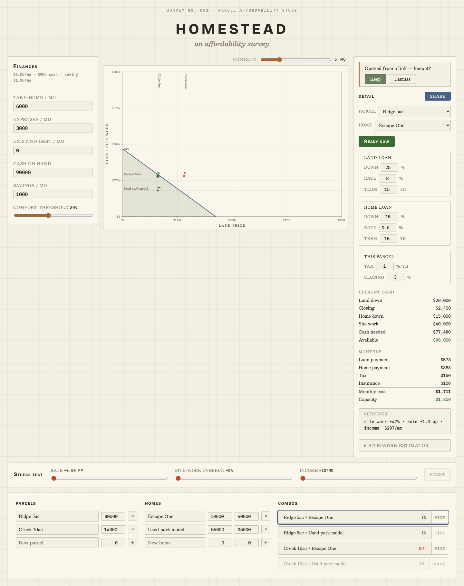

# Homestead

Homestead is a land + tiny-home affordability map. It renders your finances as
an **affordability envelope** — a polygon on a plane of land price × improvement
budget — and plots candidate parcels and home options as combo dots so you can
see, at a glance, which land-and-home pairings are within reach now and how that
reach grows over time. It is a single static [SvelteKit](https://kit.svelte.dev)
page with hand-rolled SVG (no chart library) styled as a surveyor's plat map.

## Your data stays in your browser

**All your data stays in your browser — there are no network calls, no accounts,
and no servers.** Your finances are held in memory, persisted only to
`localStorage`, and shared (when you choose to) exclusively through the URL hash
of a link you copy yourself. Nothing about your finances ever leaves the browser.

## Development

| Command | Purpose |
|---|---|
| `npm run dev` | Start the dev server |
| `npm run build` | Static build to `build/` (set `BASE_PATH=/homestead` for production parity) |
| `npm run test` | Run the Vitest suite once |
| `npm run check` | Type-check with `svelte-check` |
| `node scripts/visual-qa.mjs` | Screenshot the app at seeded states into `.visual-qa/` |

## Deploy

The site is a fully static build served from GitHub Pages under the `/homestead`
base path. The build is base-path aware — fonts and assets are bundled by Vite
and resolve correctly under `/homestead/` — so no paths are hardcoded.

Two manual, one-time actions are required to go live (they cannot be scripted
from here):

1. **Rename the GitHub repository to `homestead`** so the Pages URL matches the
   `/homestead` base path baked into the build.
2. **Set the Pages source to "GitHub Actions"** (Settings → Pages → Build and
   deployment → Source), so the workflow-produced static build is published.
